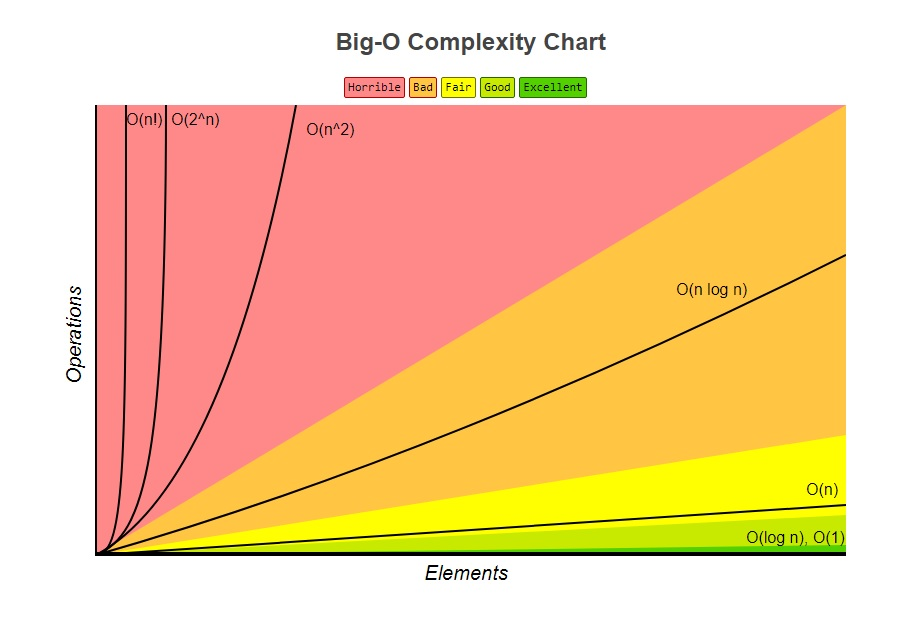
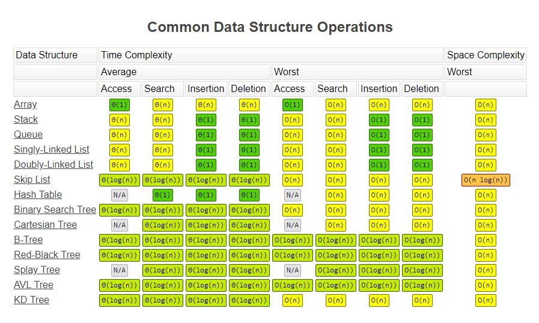
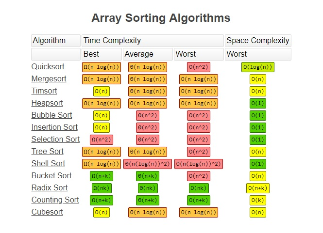

# A note on Data Structures & Algorithms

## Big-O Notation

View contents

> used to classify algorithms according to how their **run time** or **space** requirements grow as the input size grows.

#### Time Complexity

> analyze the runtime as the size of the inputs increases.

- Arithmetic operations are constant.
- Variable assignment is constant.
- Accessing elements in an array (by index) or object (by key) is constant.
- In a loop, the complexity is the length of the loop times.

#### Space Complexity

> how much additional memory do we need to allocate.

- Most primitives (booleans, numbers, undefined, null) are constant space.
- Strings require O(n) space (where n is the string length)
- Reference types are generally O(n), where n is the length (for arrays) or the number of keys (for objects)

#### Big-O Complexity Chart

source: [https://www.bigocheatsheet.com/](https://www.bigocheatsheet.com/)

#### Big-O list

- ✅ O(1) Constant Time - no loops
- ✅ O(logN) Logarithmic - usually searching algorithms have log(n) if they are sorted (Binary Search)
- ✅ O(n) Linear Time - for, while loops
- ✅ O(nlog(n)) Log Linear - usually Sorting algorithms
- ✅ O(n^2) Quadratic Time - every element in a collection needs to be compared to every other element. Two nested loops
- ✅ O(2^n) Exponential Time - recursive algorithms that solve a problem of size N
- ✅ O(n!) Factorial Time - Run a loop for every element
- ✅ Two separate inputs: O(a + b) or O(a \_ b)

#### Common Data Structure Operations

source: [https://www.bigocheatsheet.com/](https://www.bigocheatsheet.com/)

#### Array Sorting Algorithms

source: [https://www.bigocheatsheet.com/](https://www.bigocheatsheet.com/)

