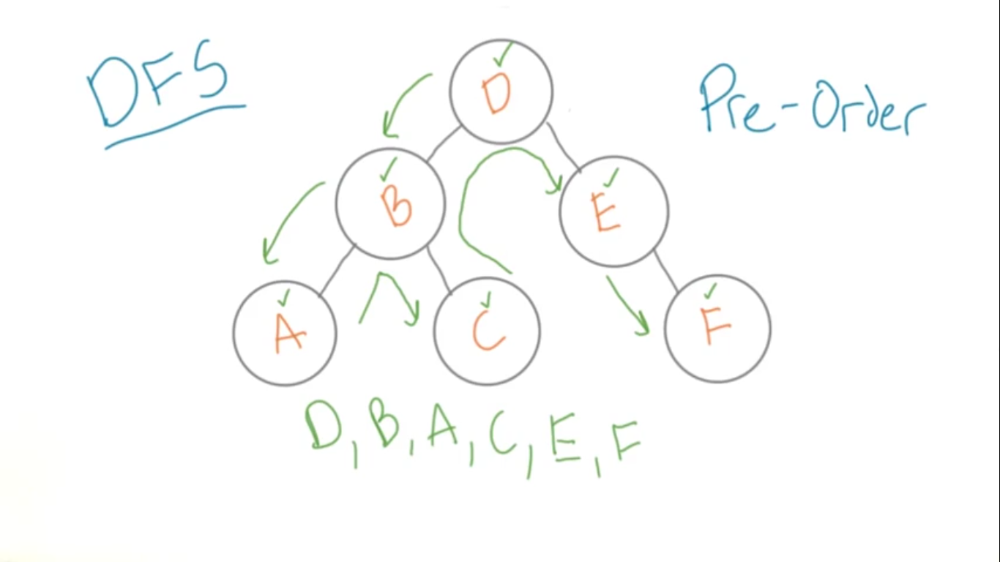
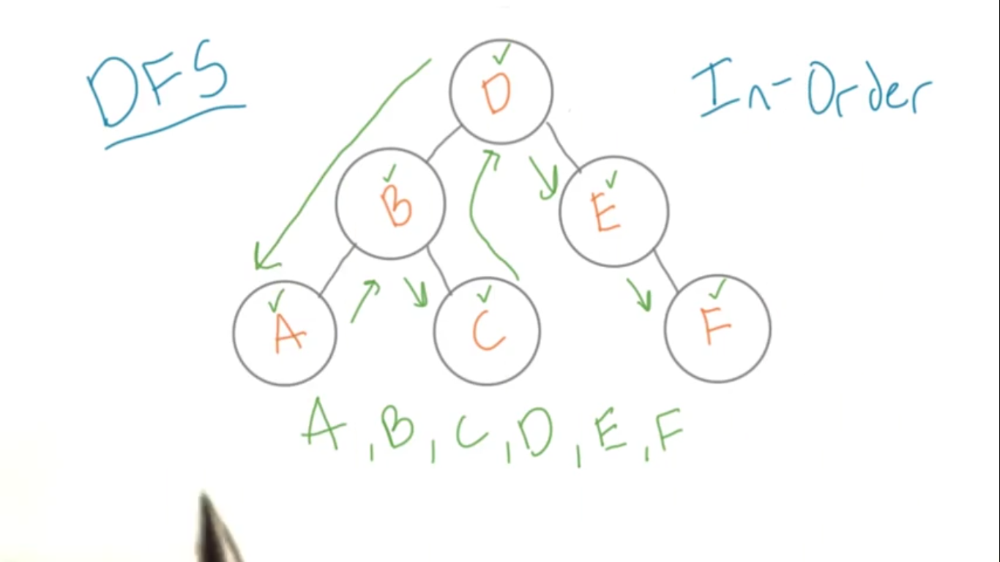
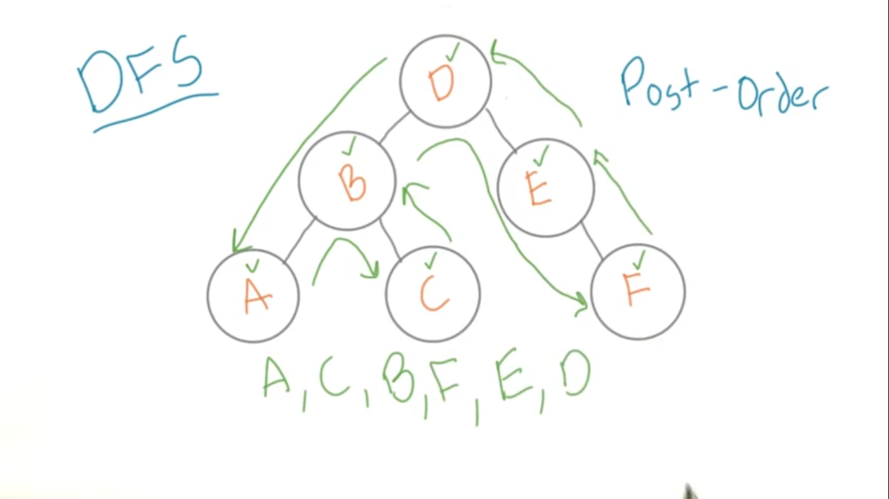
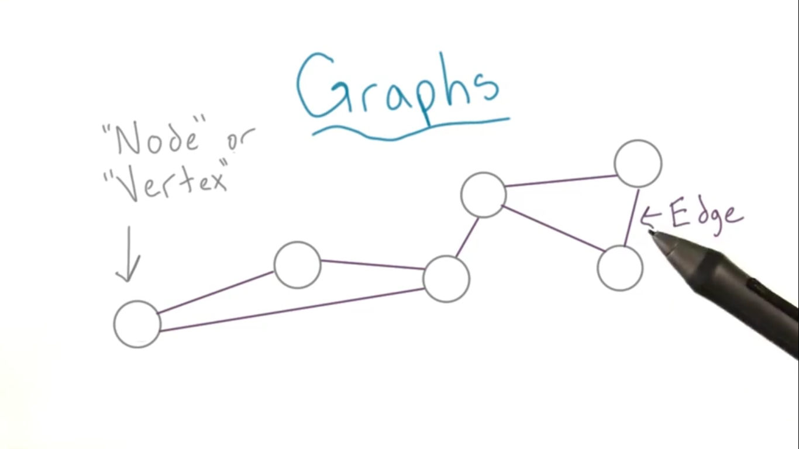

# A note on Data Structures & Algorithms

## Big-O Notation

> Used to classify algorithms according to how their **run time** or **space** requirements grow as the input size grows.

<details>
<summary>View contents</summary>

#### Time Complexity

> analyze the runtime as the size of the inputs increases.

- Arithmetic operations are constant.
- Variable assignment is constant.
- Accessing elements in an array (by index) or object (by key) is constant.
- In a loop, the complexity is the length of the loop times.

#### Space Complexity

> how much additional memory do we need to allocate.

- Most primitives (booleans, numbers, undefined, null) are constant space.
- Strings require O(n) space (where n is the string length)
- Reference types are generally O(n), where n is the length (for arrays) or the number of keys (for objects)

#### O (Big Oh), Ω (Big Omega) and Θ (Big Theta)

- Big oh (O) - defines the worst case. e.g.: O(n)
- Big Omega (Ω) - defines the best case. e.g.: Ω(1)
- Big Theta (Θ) - when best case and worst case are same. e.g.: Θ(1)

#### Big-O Complexity Chart


source: [https://www.bigocheatsheet.com/](https://www.bigocheatsheet.com/)

#### Big-O list

- ✅ **O(1) Constant Time:** no loops
- ✅ **O(logN) Logarithmic:** usually searching algorithms have log(n) if they are sorted (Binary Search) [size 8 -> 3 operations (log2^8), size 16 -> 4 operations (log2^16)]
- ✅ **O(n) Linear Time:** for, while loops
- ✅ **O(n \* logN):** Log Linear - usually Sorting algorithms
- ✅ **O(n^2) Quadratic Time:** every element in a collection needs to be compared to every other element. Two nested loops
- ✅ **O(2^n) Exponential Time:** recursive algorithms that solve a problem of size N
- ✅ **O(n!) Factorial Time:** Run a loop for every element
- ✅ **Two separate inputs:** O(a + b) or O(a \* b)

#### Common Data Structure Operations


source: [https://www.bigocheatsheet.com/](https://www.bigocheatsheet.com/)

#### Array Sorting Algorithms


source: [https://www.bigocheatsheet.com/](https://www.bigocheatsheet.com/)

</details>

## Linked List

> A linked list consists of nodes where each node contains a data field and a reference(link) to the next node in the list.

<details>
<summary>View contents</summary>


[source](https://www.geeksforgeeks.org/data-structures/linked-list/)

### Linked List Basic operations

```py

from typing import Optional, Tuple
from typing_extensions import Self


class Node:
    def __init__(self, val: int = 0, next: Optional[Self] = None):
        self.val = val
        self.next = next


class LinkedListCrud:
    def __init__(self) -> None:
        # head: 1 -> 2
        self.head = Node(1)
        self.head.next = Node(2)

    # detect loop
    def detectLoop(self) -> Optional[Node]:
        slow = self.head
        fast = self.head

        while fast and fast.next and slow != fast:
            slow = slow.next
            fast = fast.next.next

        if slow and slow == fast:
            print("Loop detected")
            return slow
        else:
            print("Loop doesn't exists")
            return None

    # initiate loop
    def initiateLoop(self, last: Node, middle: Node) -> None:
        last.next = middle

    # Find middle
    def findMiddle(self) -> Node:
        slow = self.head
        fast = self.head

        while fast and fast.next:
            slow = slow.next
            fast = fast.next.next

        return slow

    # Reverse the linked list
    def reverseLL(self):
        prev = None
        curr = self.head

        while curr:
            next = curr.next
            curr.next = prev
            prev = curr
            curr = next

        self.head = prev

    # Delete a node
    def deleteNode(self, index: int):
        dummy = Node(next=self.head)
        prev, curr = dummy, self.head
        count = -1

        while curr and count != index-1:
            prev = curr
            curr = curr.next
            count += 1

        if count+1 != index:
            print("Index {} doesn't exists".format(index))
            return

        prev.next = curr.next
        self.head = dummy.next

    # Insert at a node
    def insertAt(self, index: int, val: int) -> None:
        dummy = Node(next=self.head)
        prev, curr = dummy, self.head
        count = -1

        while curr and count != index-1:
            prev = curr
            curr = curr.next
            count += 1

        if count+1 != index:
            print("Index {} doesn't exists".format(index))
            return

        newNode = Node(val=val)
        newNode.next = curr
        prev.next = newNode
        self.head = dummy.next

        # Insert at the end
    def insertAtEnd(self, val: int) -> None:
        curr = self.head

        while curr and curr.next:
            curr = curr.next
        curr.next = Node(val)

    # Insert at the beginning
    def insertAtBeginning(self, val: int) -> None:
        dummy = Node(val)
        dummy.next = self.head
        self.head = dummy

    # get last node
    def getLastNode(self) -> Node:
        curr = self.head

        while curr and curr.next:
            curr = curr.next

        return curr

    # Print the linked list
    def printLL(self, node=None, msg: str = ""):
        if not self.head:
            print("Linked List is empty.")

        curr = node if node else self.head
        if msg:
            print(msg+":", end=" ")

        while curr:
            print(curr.val, end=" ")
            curr = curr.next
        print()


if __name__ == "__main__":
    ll = LinkedListCrud()

    # crud operations
    ll.printLL(msg="Before Insert")
    ll.insertAtBeginning(5)
    ll.printLL(msg="After inserting 5 at beginning")
    ll.insertAtEnd(100)
    ll.printLL(msg="After inserting 100 at end")
    ll.insertAt(4, 200)
    ll.printLL(msg="After inserting 200 at 4th or last index")
    ll.insertAt(0, 50)
    ll.printLL(msg="After inserting 200 at 0 or 1st index")
    ll.insertAt(2, 46)
    ll.printLL(msg="After inserting 46 at 2nd index")
    ll.deleteNode(0)
    ll.printLL(msg="After deleting beginning node")
    ll.deleteNode(5)
    ll.printLL(msg="After deleting end node")

    # revers a LL
    ll.reverseLL()
    ll.printLL(msg="After reversing the linked list")

    # find middle
    middleNode = ll.findMiddle()
    ll.printLL(node=middleNode, msg="Middle Node")

    # find loop, remove loop, find length of loop
    lastNode = ll.getLastNode()
    ll.initiateLoop(lastNode, middleNode)
    ll.detectLoop()
```

```
Before Insert: 1 2
After inserting 5 at beginning: 5 1 2
After inserting 100 at end: 5 1 2 100
After inserting 200 at 4th or last index: 5 1 2 100 200
After inserting 200 at 0 or 1st index: 50 5 1 2 100 200
After inserting 46 at 2nd index: 50 5 46 1 2 100 200
After deleting beginning node: 5 46 1 2 100 200
After deleting end node: 5 46 1 2 100
After reversing the linked list: 100 2 1 46 5
Middle Node: 1 46 5
Loop detected
```

</details>

## Tree

> A tree is non-linear and a hierarchical data structure consisting of a collection of nodes such that each node of the tree stores a value and a list of references to other nodes (the “children”). <sup>[ref](https://www.geeksforgeeks.org/introduction-to-tree-data-structure-and-algorithm-tutorials/)</sup>

<details>
<summary>View contents</summary>

### Binary Tree

> A tree is a non-linear data structure. It has no limitation on the number of children. A binary tree has a limitation as any node of the tree has at most two children: a left and a right child.

<details>
<summary>View contents</summary>


#### Some terminology of Complete Binary Tree:

- Root – Node in which no edge is coming from the parent. Example -node A
- Child – Node having some incoming edge is called child. Example – nodes B, H are the child of A and D respectively.
- Sibling – Nodes having the same parent are sibling. Example- J, K are siblings as they have the same parent E.
- Degree of a node – Number of children of a particular parent. Example- Degree of A is 2 and Degree of H is 1. Degree of L is 0.
- Internal/External nodes – Leaf nodes are external nodes and non leaf nodes are internal nodes.
- Level – Count nodes in a path to reach a destination node. Example- Level of node H is 3 as nodes A, D and H themselves form the path.
- Height – Number of edges to reach the destination node, Root is at height 0. Example – Height of node E is 2 as it has two edges from the root.

#### Properties of Complete Binary Tree:

- A complete binary tree is said to be a proper binary tree where all leaves have the same depth.
- In a complete binary tree number of nodes at depth d is 2d.
- In a complete binary tree with n nodes height of the tree is log(n+1).
- All the levels except the last level are completely full.

#### Perfect Binary Tree vs Complete Binary Tree:

A binary tree of height ‘h’ having the maximum number of nodes is a perfect binary tree.
For a given height h, the maximum number of nodes is 2h+1-1.

A complete binary tree of height h is a proper binary tree up to height h-1, and in the last level element are stored in left to right order.

References:

- [Complete Binary Tree](https://www.geeksforgeeks.org/complete-binary-tree/)
- [Binary Tree Data Structure](https://www.geeksforgeeks.org/binary-tree-data-structure/)

</details>

### Breath First Traversals

<details>
<summary>View contents</summary>


    


**Implementation (using queue):**

```py
def bfs(self, root: Optional[TreeNode]) -> int:
        if not root:
            return 0

        queue = [root]

        while queue:
            next_level = []

            for node in queue:
                print(node.val)

                if node.left:
                    next_level.append(node.left)

                if node.right:
                    next_level.append(node.right)

            # Move to the next level
            queue = next_level
```

</details>

### Depth First Traversals

<details>
<summary>View contents</summary>

1. Pre-order: `root, left ..., right ...`



2. In-order: `left ..., root, right ...`



3. Post-order: `left ..., right ..., root`



source: [data structures and algorithms in python](https://classroom.udacity.com/courses/ud513/lessons/7114284829/concepts/77366995150923)

**Implementation (using recursion):**

```py
class Node:
    def __init__(self, val):
        self.val = val
        self.left = None
        self.right = None


# left - root - right
def printInOrder(root):
    if root:
        printInOrder(root.left)
        print(root.val, end=" ")
        printInOrder(root.right)


# root - left - right
def printPreOrder(root):
    if root:
        print(root.val, end=" ")
        printPreOrder(root.left)
        printPreOrder(root.right)


# left - right - root
def printPostOrder(root):
    if root:
        printPostOrder(root.left)
        printPostOrder(root.right)
        print(root.val, end=" ")


if __name__ == "__main__":
    root = Node("D")
    root.left = Node("B")
    root.right = Node("E")
    root.left.left = Node("A")
    root.left.right = Node("C")
    root.right.right = Node("F")

    print("Pre Order:", end=" ")
    printPreOrder(root)
    print()

    print("In Order:", end=" ")
    printInOrder(root)
    print()

    print("Post Order:", end=" ")
    printPostOrder(root)
```

**Implementation (using stack):**

```py
class Node:
    def __init__(self, val):
        self.val = val
        self.left = None
        self.right = None


def printPreOrder(root):
    stack = [root]

    while stack:
        node = stack.pop()
        print(node.val)

        if node.right:
            stack.append(node.right)
        if node.left:
            stack.append(node.left)


if __name__ == '__main__':
    D = Node('D')
    B = Node('B')
    E = Node('E')
    A = Node('A')
    C = Node('C')
    F = Node('F')

    D.left = B
    D.right = E
    B.left = A
    B.right = C
    E.right = F

    printPreOrder(D)
```

</details>

</details>

## Trie

> A trie (pronounced as "try") or prefix tree is a tree data structure used to efficiently store and retrieve keys in a dataset of strings. There are various applications of this data structure, such as autocomplete and spellchecker.

<details>
<summary>View contents</summary>


[source](https://en.wikipedia.org/wiki/Trie#/media/File:Trie_example.svg)

### Implement Trie

```py
class TrieNode:
  def __init__(self):
    self.children = {}
    self.endOfWord = False

class Trie:

    def __init__(self):
      self.root = TrieNode()


    def insert(self, word: str) -> None:
      curr = self.root

      for ch in word:
        if ch not in curr.children:
          curr.children[ch] = TrieNode()
        curr = curr.children[ch]

      curr.endOfWord = True


    def search(self, word: str) -> bool:
      curr = self.root

      for ch in word:
        if ch not in curr.children:
          return False
        curr = curr.children[ch]
      return curr.endOfWord


    def startsWith(self, prefix: str) -> bool:
      curr = self.root

      for ch in prefix:
        if ch not in curr.children:
          return False
        curr = curr.children[ch]

      return True

trie = Trie()
trie.insert("apple")
trie.search("apple") # True
trie.search("app") # False
trie.startsWith("app") # True
```

</details>

## Graph

> Graph is a data structure designed to show relationships between objects.

<details>
<summary>View contents</summary>

The purpose of a graph is to show how different things are connected to one another (also known as network). A graph is similar to a tree.



### BFS (Breath First Search)

<details>
<summary>View contents</summary>

[BFS in geekforgeeks](https://www.geeksforgeeks.org/breadth-first-search-or-bfs-for-a-graph/)

</details>

</details>

# Problem Solving Patterns

## Time complexity

<details>
<summary>View contents</summary>

Let n be the main variable in the problem.

- If n ≤ 12, the time complexity can be O(n!).
- If n ≤ 25, the time complexity can be O(2n).
- If n ≤ 100, the time complexity can be O(n4).
- If n ≤ 500, the time complexity can be O(n3).
- If n ≤ 104, the time complexity can be O(n2).
- If n ≤ 106, the time complexity can be O(n log n).
- If n ≤ 108, the time complexity can be O(n).
- If n > 108, the time complexity can be O(log n) or O(1).

**Examples of each common time complexity**

- O(n!) [Factorial time]: Permutations of 1 ... n
- O(2n) [Exponential time]: Exhaust all subsets of an array of size n
- O(n3) [Cubic time]: Exhaust all triangles with side length less than n
- O(n2) [Quadratic time]: Slow comparison-based sorting (eg. Bubble Sort, Insertion Sort, Selection Sort)
- O(n log n) [Linearithmic time]: Fast comparison-based sorting (eg. Merge Sort)
- O(n) [Linear time]: Linear Search (Finding maximum/minimum element in a 1D array), Counting Sort
- O(log n) [Logarithmic time]: Binary Search, finding GCD (Greatest Common Divisor) using Euclidean Algorithm
- O(1) [Constant time]: Calculation (eg. Solving linear equations in one unknown)

</details>

## Problem Solving Tips

<details>
<summary>View contents</summary>

If input array is sorted then

- Binary search
- Two pointers

If asked for all permutations/subsets then

- Backtracking

If given a tree then

- DFS
- BFS

If given a graph then

- DFS
- BFS

If given a linked list then

- Two pointers

If recursion is banned then

- Stack

If must solve in-place then

- Swap corresponding values
- Store one or more different values in the same pointer

If asked for maximum/minimum subarray/subset/options then

- Dynamic programming

If asked for top/least K items then

- Heap
- QuickSelect

If asked for common strings then

- Map
- Trie

Else

- Map/Set for O(1) time & O(n) space
- Sort input for O(nlogn) time and O(1) space

source: [Sean Prashad's Leetcode Patterns](https://seanprashad.com/leetcode-patterns/)

</details>

## Arithmetic

1. Digit to sum (input: 123, output: 6)

<details>
<summary>View solutions</summary>

**Solution 1:**

```js
function dititToSum(n) {
  let sum = 0;

  for (; n; n = Math.floor(n / 10)) {
    sum += n % 10;
  }

  return sum;
}

digitToSum(123); // 6
```

</details>

2. Lenght of a number

<details>
<summary>View solutions</summary>

**Solution 1**

`javascript`

```js
function digitToLength(num) {
  if (num === 0) {
    return 1;
  }
  return Math.floor(Math.log10(num)) + 1;
}
```

`python`

```py
import math
def digitToLength(num):
  if num == 0:
    return 1
  return math.floor(math.log10(num)) + 1
```

</details>

3. Reverse a number (input: -123, output: -321)

<details>
<summary>View solutions</summary>

**Solution 1**

```js
function reverse(num) {
  let r = 0;

  for (let i = Math.abs(num); i != 0; ) {
    r = r * 10;
    r = r + (i % 10);
    i = Math.floor(i / 10);
  }

  return num < 0 ? -r : r;
}

reverse(-123); // -321
```

</details>

4. Big modular

<details>
<summary>View solutions</summary>

**Solution 1**

```js
// a ^ b % M

function bigMod(a, b, M) {
  if (b === 0) return 1 % M;

  let x = bigMod(a, Math.floor(b / 2), M);
  console.log({ x1: x });
  x = (x * x) % M;
  console.log({ x2: x });
  if (b % 2 === 1) x = (x * a) % M;
  console.log({ x3: x });
  return x;
}

console.log(bigMod(2, 5, 7)); // 2 ^ 5 % 7 = 4
console.log(bigMod(2, 100, 7)); // 2 ^ 5 % 7 = 2
```

</details>

## Common Patterns

### 1. Sliding window

<details>
<summary>View contents</summary>

Identify sliding window problems:

1. Input is array/string
2. subarray/substring -> largest/minimum/maximum
3. Given k window size or have to calculate window size

2 Types of sliding windows:

1. Fixed Size Window

<details>
<summary>View codes</summary>

```py
# Find maximum sum sub array of k size

def maxPrice(arr, k):
  total = sum(arr[:k])
  max_price = total

  for i in range(len(arr) - k):
    total -= arr[i]
    total += arr[k+i]
    max_price = max(total, max_price)

  return max_price

maxPrice([1,4,5,6], 3) # 15
```

</details>

2. Variable Size Window

</details>

## Array

1. Define a 2D array

<details>
<summary>View solutions</summary>

```js
const row = 5;
const col = 4;
const val = 0;
const myGrid = [...Array(row)].map(() => Array(col).fill(val));
```

</details>

2. Prefix Sum of Matrix (Or 2D Array)

<details>
<summary>View solutions</summary>

```js
// Formula
psa[i][j] = psa[i - 1][j] + psa[i][j - 1] - psa[i - 1][j - 1] + a[i][j];
```

</details>

## Linked List

1. Find middle node (Input: head = [1,2,3,4] Output: [3,4])

<details>
<summary>View solutions</summary>

**Solution 1**

```js
function getMiddleNode(head) {
  let fast = head;
  let slow = head;

  while (fast !== null && fast.next !== null) {
    fast = fast.next.next;
    slow = slow.next;
  }

  return slow;
}
```

</details>

2. Detect a Linked List Cycle

<details>
<summary>View solutions</summary>

**Solution 1**

```js
function detectLLCycle(head) {
  let fast = head;
  let slow = head;

  while (fast !== null && fast.next !== null && slow !== fast) {
    fast = fast.next.next;
    slow = slow.next;
  }

  if (slow === fast) return true;
  return false;
}
```

</details>

3. Reverse a linked list

<details>
<summary>View solutions</summary>

**Solution 1**


```js
function reverseLL(head) {
  let curr = head;
  let prev = null;

  while (curr !== null) {
    let next = curr.next;
    curr.next = prev;
    prev = curr;
    curr = next;
  }

  return prev;
}
```

</details>

## Import Problems

<details>
<summary>View contents</summary>
1. Swap Two Numbers

<details>
<summary>View solutions</summary>

**[You can find all the code here](https://github.com/foyez/cp-patterns/tree/main/codes/1-swap-two-numbers.py)**

```py
a, b = 10, 20

# solution 1: Third variable
t = a
a = b
b = t


# solution 2: addition & subtraction
a = a + b  # 10 + 20 = 30
b = a - b  # 30 - 20 = 10
a = a - b  # 30 - 10 = 20


# solution 3: multiplication & division
a = a*b  # 10 * 20 = 200
b = a/b  # 200 / 20 = 10
a = a/b  # 200 / 10 = 20


# solution 4: bitwise XOR(^)
a = a ^ b  # 01010 ^ 10100 = 11110 = 30
b = a ^ b  # 11110 ^ 10100 = 01010 = 10
a = a ^ b  # 11110 ^ 01010 = 10100 = 20


# solution 5: single line
a, b = b, a
```

</details>

</details>
